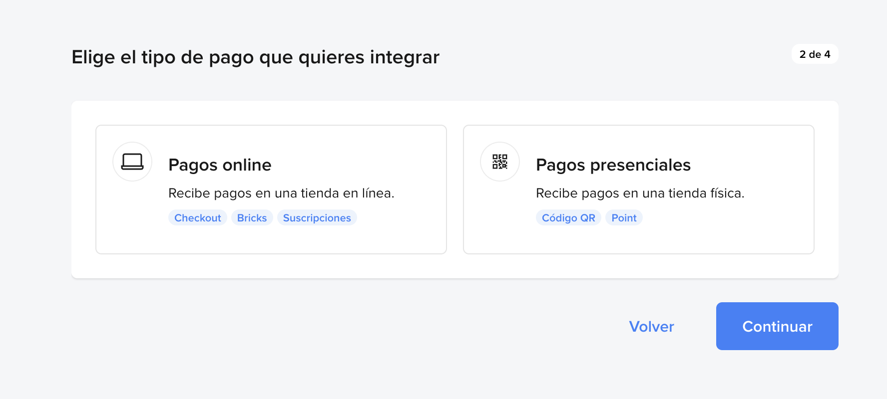

# Mercado Pago

Esta guía explica cómo crear tu app en Mercado Pago, activar credenciales de producción, copiar tu Access Token y configurar el Webhook Secret.

## 1) Crea una aplicación
En el panel de Developers, inicia el asistente y escribe el nombre de tu app.

## 2) Elige el tipo de pago
Selecciona **Pagos online** (si vas a cobrar en una tienda en línea).

## 3) Define cómo hiciste la tienda
Elige **Con un desarrollo propio** (u otra opción si aplica) y continúa.

## 4) Selecciona Checkout API
En la sección de Checkouts, selecciona **Checkout API**.

## 5) Elige API de Pagos
Selecciona **API de Pagos** y continúa.

## 6) Confirma las opciones
Revisa la configuración, acepta términos y confirma la creación.

## 7) Abre el detalle de la app
Ya creada la app, verás el panel con sus detalles.

## 8) Activa credenciales de producción (si aplica)
Completa los datos del negocio, acepta el aviso y activa.

## 9) Copia tu Access Token de producción
En **Credenciales de producción**, copia el **Access Token**.

## 10) Entra a Webhooks
Ve a **Notificaciones > Webhooks** y abre la configuración.

## 11) Configura y guarda los webhooks
Selecciona **Modo productivo**, pega tu URL, elige los eventos necesarios, guarda la configuración y copia la **Clave secreta** del webhook.

## Notas de seguridad
- No compartas tu **Access Token** ni la **Clave secreta** del webhook en repositorios públicos.
- Guarda ambos valores en un secret manager o variables de entorno.
