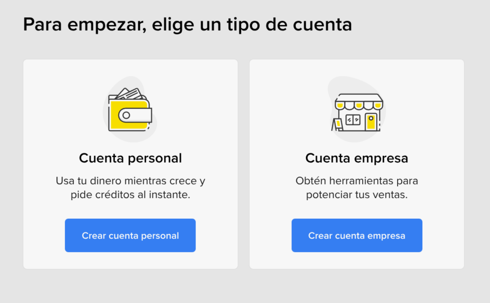
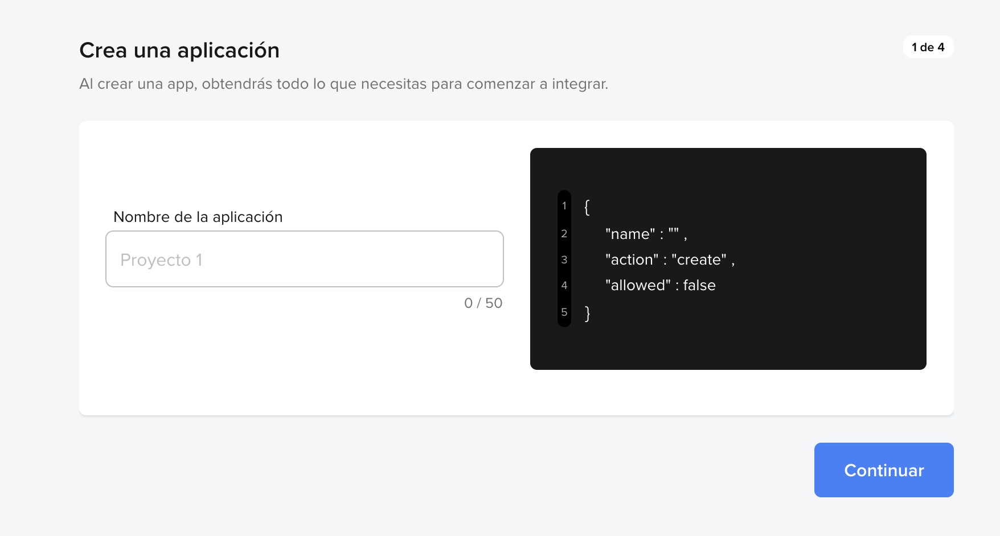
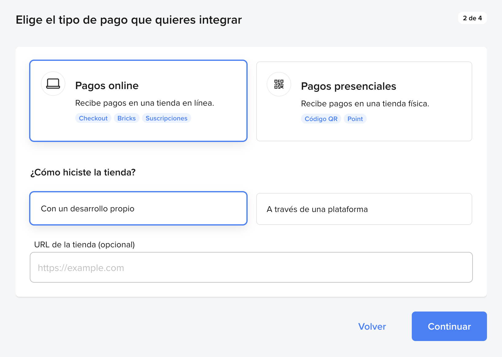
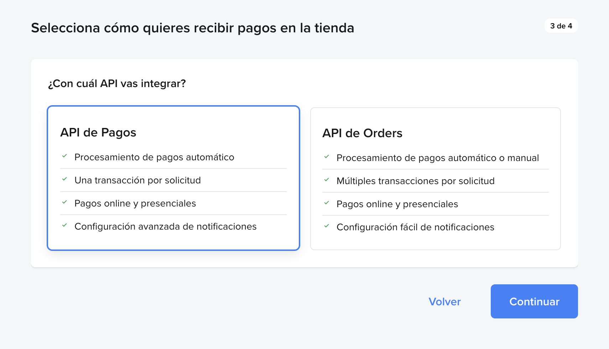
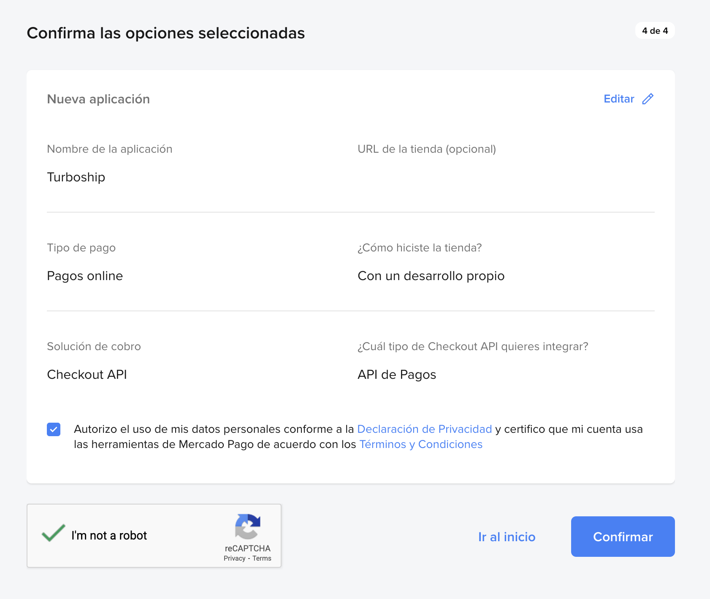
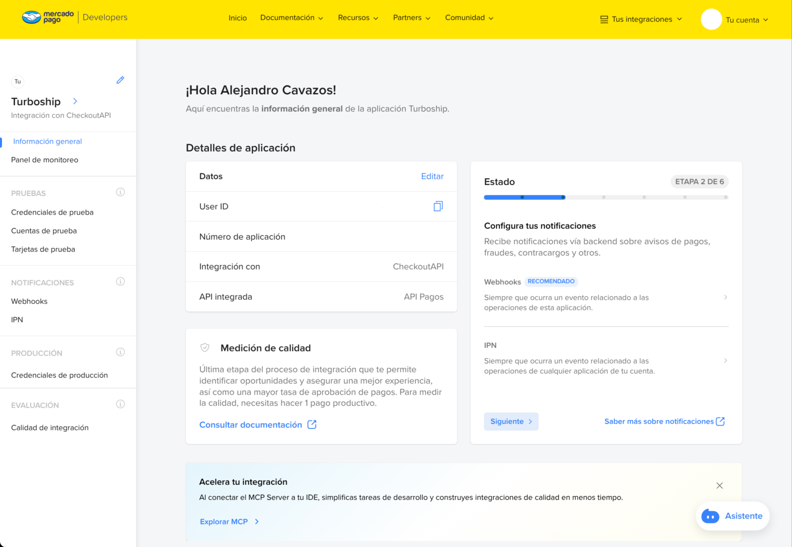
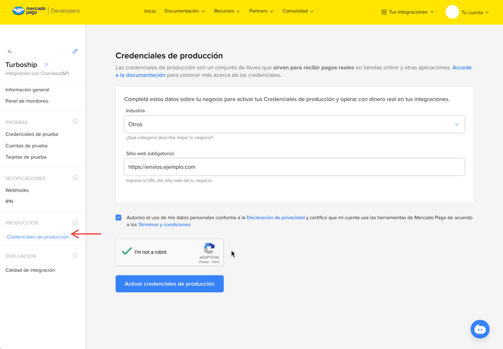
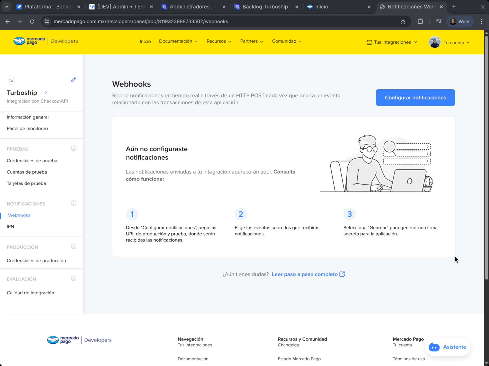
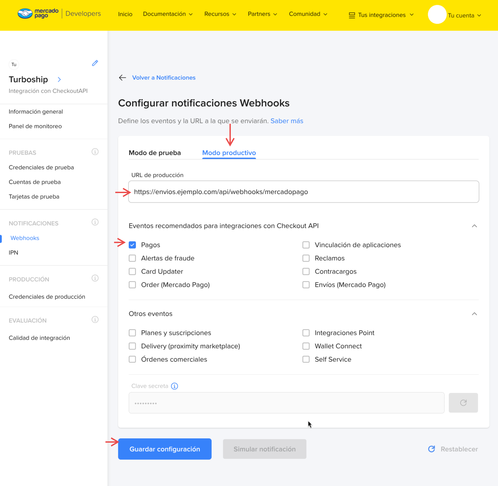
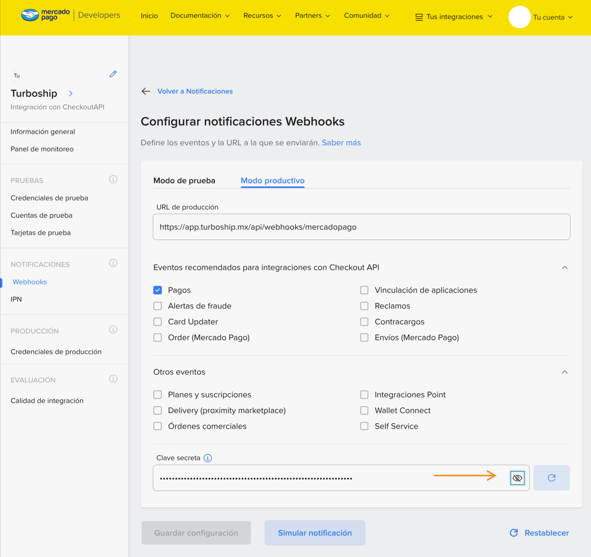

import { AlertTriangle } from 'lucide-react';

# Mercado Pago

Esta guía describe cómo conectar Mercado Pago con Turboship para automatizar los cobros a tus clientes y la acreditación de su saldo. Mercado Pago aplica comisiones que varían según el método de pago elegido; consulta el detalle aquí: https://www.mercadopago.com.mx/herramientas-para-vender/check-out#benefits-checkout.

## Prerrequisitos
Antes de iniciar, asegúrate de tener una cuenta de Mercado Pago tipo empresa, activada y con al menos 1 depósito recibido.

Si aún no tienes cuenta, regístrate aquí: https://www.mercadopago.com.mx/hub/registration/splitter?origin=router.

## 1) Crea una aplicación
Acceda al portal de desarrolladores utilizando el siguiente link para crear una nueva aplicación.

Enlace directo: https://www.mercadopago.com.mx/developers/panel/app/create-app

Nombre de la aplicación: **Turboship**

## 2) Define el tipo de pago y tienda
Selecciona **Pagos online** y **Con un desarrollo propio**, luego continúa.

## 3) Selecciona Checkout API
En la sección de Checkouts, selecciona **Checkout API**.

## 4) Elige API de Pagos
Selecciona **API de Pagos** y continúa.

## 5) Confirma las opciones
Revisa la configuración, acepta términos y confirma la creación.

## 6) Abre el detalle de la app
Ya creada la app, verás el panel con sus detalles.

## 7) Activa credenciales de producción
En la barra lateral, haz click en **Credenciales de producción**. En industria selecciona **Otros**, coloca la URL de tu plataforma de envíos, acepta los términos y condiciones y activa las credenciales de producción.

## 8) Copia tu Access Token de producción
En **Credenciales de producción**, copia el **Access Token** y guárdalo en un lugar seguro para ingresarlo posteriormente en la plataforma.

## 9) Entra a Webhooks
En la barra lateral, entra a **Notificaciones > Webhooks** y luego haz clic en **Configurar notificaciones**.

## 10) Configura y guarda los webhooks
Selecciona **Modo productivo**. En la URL, usa la URL de tu plataforma seguida de `/api/webhooks/mercadopago`, como aparece en la imagen.

  <AlertTriangle color="#f59e0b" size="1em" aria-hidden="true" style={{ display: 'block', flexShrink: 0 }} />
  
Es muy importante que esta URL sea correcta.

En **Eventos recomendados**, selecciona **Pagos** y guarda la configuración.

## 11) Copia la clave secreta del webhook
Después de guardar, copia la **Clave secreta** del webhook y guárdala en un lugar seguro para ingresarla posteriormente en la plataforma.

